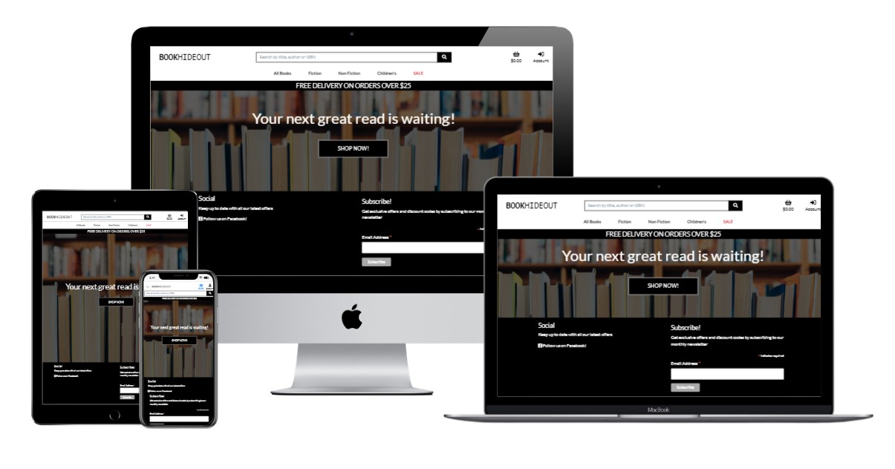
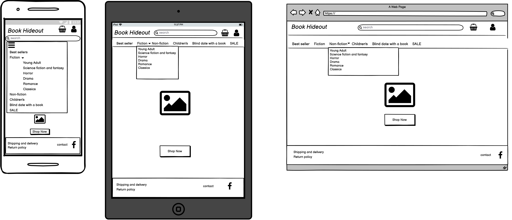
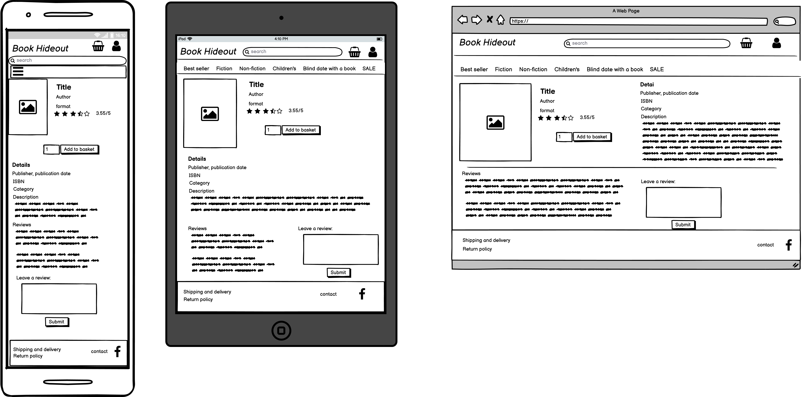

# BookHideout
(Developer: Ana Runje)

[Live webpage](https://ci-pp5-bookhideout.herokuapp.com/)

## Table of Content

1. [Project Goals](#project-goals)
    1. [User Goals](#user-goals)
    2. [Site Owner Goals](#site-owner-goals)
2. [Web Marketing](#web-marketing)
3. [User Experience](#user-experience)
    1. [Target Audience](#target-audience)
    2. [User Requirements and Expectations](#user-requirements-and-expectations)
    3. [User Stories](#user-stories)
    4. [Site Owner Stories](#site-owner-stories)
4. [Design](#design)
    1. [Design Choices](#design-choices)
    2. [Structure](#structure)
    3. [Wireframes](#wireframes)
5. [Technologies Used](#technologies-used)
    1. [Languages](#languages)
    2. [Frameworks](#frameworks)
    3. [Database](#database)
    4. [Tools](#tools)
6. [Features](#features)
7. [Testing and validation](#testing-and-validation)
    1. [HTML Validation](#HTML-validation)
    2. [CSS Validation](#CSS-validation)
    3. [JavaScript Validation](#javascript-validation)
    4. [Accessibility](#accessibility)
    5. [Performance](#performance)
    6. [Device testing](#performing-tests-on-various-devices)
    7. [Browser compatibility](#browser-compatability)
    8. [Manual testing](#manual-testing)
8. [Bugs](#Bugs)
9. [Deployment](#deployment)
10. [Credits](#credits)
11. [Acknowledgments](#acknowledgments)

## Project Goals 
BookHideout is a e-commerce web app. Users can shop for books on the page. 

### User Goals
- Buying books

### Site Owner Goals
- Providing a platform for users to buy books

## Web Marketing

### Facebook Campaign
As Facebook is be a staple in any social media marketing strategy. A Facebook Business Page was created for my site and the facebook social link on the footer will bring a user directly here.

[Facebook Business Page](docs/facebook_business_page.jpg)

### Newsletter Marketing Campaign
Mailchimp email marketing was used generate an email signup form for the footer. This free service allows the site owner to manage, run and analyse the success of their newsletter marketing campaign by following the simple steps on the mailchimp site to generate an email form.

### SEO
In order to improve the sites search engine ranking two important files were added to the project :

A sitemap.xml file This file was added to help speed up content discovery for search engines when they crawl and index the web applications.
A robots.txt file This fil was added to acknowledge that search engines are allowed on the site and that they may have free access to it. A robots.txt file is a simple text file that tells search engines where they are not allowed to go on a website. It lists out any folders or files that will not be crawled or indexed by search engine spiders.

## User Experience

### Target Audience
- people looking to buy books

### User Requirements and Expectations
- A simple and intuitive navigation system
- Quick and easy to use
- Links and functions that work as expected
- Good presentation and a visually appealing design regardless of screen size
- Options for superusers to create, view, edit and delete new products and sales
- Accessibility

### User Stories
1. As a shopper I want to be able to see a list of products so that I can find something to purchase
2. As a shopper I want to be able to view products by category so that I can quickly find products I'm interested in, without having to go through all products
3. As a shopper I want to be able to view individual products so that I can see all the information available about this product
4. As a shopper I want to be able to quickly identify sales so that I can save on products I want to purchase
5. As a shopper I want to be able to easily see how much the total of my shopping cart is so that I can keep track of my spending
6. As a shopper I want to be able to filter products so that I can find what I'm looking for more easily
7. As a shopper I want to be able to sort products so that I can find the best priced or best-rated product or sort products by name
8. As a shopper I want to be able to search for a product by name, description, or ISBN so that I can find a specific product
9. As a shopper I want to be able to see a search summary so that I can decide if my search query was a good one and if the product I want is available
10. As a shopper I want to be able to select the quantity of a product so that I can easily add multiples of the same product to my shopping cart
11. As a shopper I want to be able to view my cart so that I can see all the products I'm about to purchase and the total cost of them
12. As a shopper I want to be able to change the quantity or remove items from the cart so that I can make changes to my purchase before checkout
13. As a shopper I want to be able to enter my shipping and payment details so that I can quickly and securely complete my purchase
14. As a shopper I want to be able to see an order confirmation after checkout so that I can make sure my purchase was successful and without any mistakes
15. As a shopper I want to be able to receive a confirmation email after checking out so that I can keep the confirmation of what I've purchased for my records
16. As a site user I want to be able to easily navigate the site so that I can easily find what I'm looking for
17. As a site user I want to be able to register for an account so that I can have a personal account and can view a personal profile
18. As a site user I want to be able to login or logout of my personal account so that I can access my personal information securely
19. As a site user I want to be able to recover my password so that I can access my account if I forget my password
20. As a site user I want to be able to receive a confirmation email after registering an account so that I can verify my account registration was successful
21. As a site user I want to be able to access my user profile so that I can view my order history, and save my payment and shipping information
22. As a site user I want to be able to edit the information in my user profile so that I can keep my shipping and payment information up to date
23. As a store owner I want to be able to add a product so that I can add new items to the store when needed
24. As a store owner I want to be able to update product information so that I can change prices, descriptions and other product information
25. As a store owner I want to be able to delete products so that I can remove products from the store that are no longer available
26. As a shopper I want to be able to see a homepage that clearly shows the purpose of the site so that I can decide whether to shop here
27. As a shopper I want to be able to feel my personal and payment information are safe and secure so that I can confidently provide the information needed to complete a purchase
28. As a store owner I want to be able to create sales so that I can offer sales to customers
29. As a store owner I want to be able to edit sales so that I can edit a sale if there is a mistake in it
30. As a store owner I want to be able to delete sales so that I can remove past sales or sales that I changed my mind about
31. As a store owner I want to be able see all sales created so that I can plan for future sales

## Design

### Design Choices
The webpage was designed to be simple, clean and modern looking

### Structure
The page is structured in a user-friendly and easy-to-learn way. Upon arriving at the website the user sees the home page, with a call to action. The website consists of 16 separate pages:
1. Home page
2. All products page
3. Product details page
4. Add product page
5. Edit product page
6. Add sale page
7. Edit sale page
8. Bag page
9. Checkout page
10. Checkout success page
11. Profile page
12. Login page
13. Sign up page
14. Logout page
15. Manage sales page
16. 404 page

### Wireframes

Home

Book Details

## Technologies Used

### Languages
- HTML
- CSS
- JavaScript
- Python

### Frameworks, libraries and other technologies
- Django 3.2.8
- Django supporting libraries:
    - allauth for authentication, registration, login and logout functionality
    - gunicorn as the server for Heroku
    - psycopg2 as an adaptor for Python and PostgreSQL databases
    - dj-database to parse the database URL from the environment variables in Heroku
    - boto3 for aws s3 storage
    - stripe as a payment provider 
    - crispy-forms to style forms with Bootstrap 4
- Bootstrap 4
- Fontawesome
- aws

### Database
- Heroku Postgres

### Tools
- Git
- GitHub
- Gitpod
- Balsamiq
- Favicon.io to create the favicon
- JSHint
- Lighthouse
- W3C Markup validation service
- W3C Jigsaw CSS validation service 
- WAVE WebAIM web accessibility evaluation tool
- flake8 to check for errors in python code
- Techsini Multi Device Website Mockup Generator
- Heroku Cloud Application Platform

## Features
The site consists of 16 pages and 30 features

### Feature
1. Call to action (shop now button)
2. Navigation bar
3. Newsletter sign-up form 
4. Search bar
5. Lower navbar for filtering and sorting items
6. Product details page
7. All products page
8. Sort by selection box
9. Product details page
10. Add to basket
11. Quantity input for items
12. Checkout form
13. Shopping bag overview
14. Save delivery information
15. Bag preview
16. Action messages to the user
17. Order summary
18. Checkout success summary
19. Account sign-up form
20. Registration confirmation email
21. Profile page
21. Update delivery information
22. Order history
23. Product management
24. Add book form
25. Edit book form 
26. Delete book
27. Sales management
28. Add sale form 
29. Edit sale form
30. Delete sale

## Testing and validation

### HTML Validation

### CSS Validation

### JavaScript Validation

### Accessibility

### Performance 

### Performing tests on various devices 
The website was tested on the following devices:

- Lenovo Yoga 2 Pro (both in pc and tablet mode)
- Xiaomi Redmi Note 7
- Samsung Galaxy A52s 5G
- MacBook Pro

In addition, the website was tested using the Google Chrome Developer Tools Device Toggling option for all available device options.

### Browser Compatability
The website was tested on the following browsers:

- Google Chrome
- Mozilla Firefox
- Microsoft Edge

### Testing 
The page was tested manually. The testing write-up can be found in [testing.md](testing.md)

## Bugs
Remaining bugs:
- unable to add/update images for products both by url and by selecting a file

## Deployment
The app was deployed on Heroku by following these steps:
### Heroku
1. Create your Heroku app
- Navigate to the Heroku website
- In the Heroku browser window, create an account by entering your email address and a password
- Activate the account through the authentication email sent to your email account
- Click the new button and select create a new app from the dropdown menu
- Enter a name for the application which must be unique
- Select the region closest to you
- Click create app
2. Create the Database
- In the Heroku dashboard click on the Resources tab
- Scroll down to Add-Ons, search for and select 'Heroku Postgres'
3. Set up Environment Variables
- In the Heroku Settings tab, scroll down to 'Reveal Config Vars' and transfer you environment variables here
4. Set up aws s3 for static and media files storage
5. Add Heroku Hostname to ALLOWED_HOSTS: ALLOWED_HOSTS = ['favoureats.herokuapp.com', 'localhost'] in your settings.py
6. Create Procfile in top level directory:
    - In Procfile add: web: gunicorn app_name .wsgi
7. Heroku Deployment:
- Click Deploy tab in Heroku
- In the 'Deployment method' section select 'Github' and click the 'connect to Github' button to confirm.
- In the 'search' box enter the Github repository name for the project
- Click search and then click connect to link the heroku app with the Github repository. The box will confirm that heroku is connected to the repository.
8. Final Deployment
- When development is complete change the debug setting to: DEBUG = False in settings.py
- To manually deploy click the button 'Deploy Branch'. The default 'main' option in the dropdown menu should be selected in both cases. When the app is deployed a message 'Your app was successfully deployed' will be shown. Click 'view' to see the deployed app in the browser. The live deployment of the project can be seen here

### Forking the Repository
- To fork the project navigate to the repository on GitHub
- Click on the Fork button in the upper right-hand corner

### Cloning the Repository
- To clone the project navigate to the repository on GitHub
- Above the list of files click the dropdown code menu.
- Select if you prefer to clone using HTTPS, SSH, or Github CLI and click the copy button to copy the URL to your clipboard
- Open Git Bash
- Change the current working directory to the one where you want the cloned directory
- Type git clone and paste the URL from the clipboard ($ git clone https://github.com/YOUR-USERNAME/YOUR-REPOSITORY)
- Press Enter to create your local clone.

## Credits
### Media
- Homepage background image: Photo by <a href="https://unsplash.com/@jruscello?utm_source=unsplash&utm_medium=referral&utm_content=creditCopyText">Jessica Ruscello</a> on <a href="https://unsplash.com/?utm_source=unsplash&utm_medium=referral&utm_content=creditCopyText">Unsplash</a>
 - noimage.png taken from Boutique Ado walkthrough project
 - Book cover images taken from Kaggle dataset (https://www.kaggle.com/yamqwe/bulk-bookstore-dataset)

### Code
- Remove Arrows/Spinners from input type number - code taken from https://www.w3schools.com/howto/howto_css_hide_arrow_number.asp

### Data
- book data was mostly taken from a dataset at Kaggle (https://www.kaggle.com/yamqwe/bulk-bookstore-dataset), other data was added manually from Goodreads (https://goodreads.com) and Amazon (https://www.amazon.co.uk/)

## Acknowledgments
I would like to take the opportunity to thank:
- My husband Jure Runje for his support, advice, help with testing, and for giving me some kids free time to work on my project.
